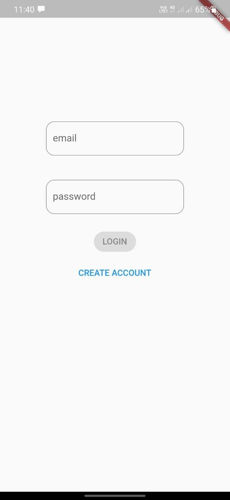
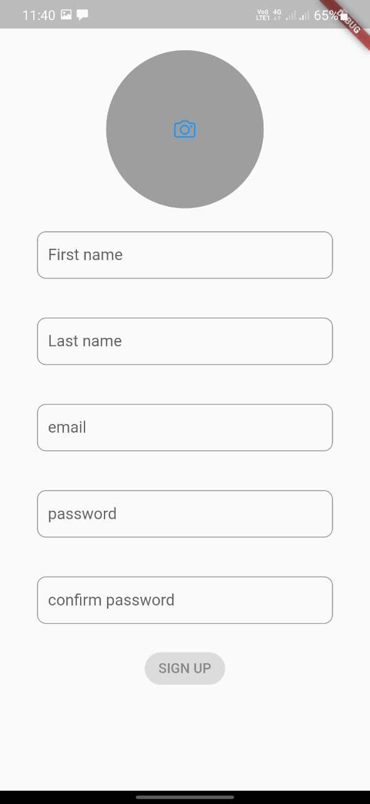
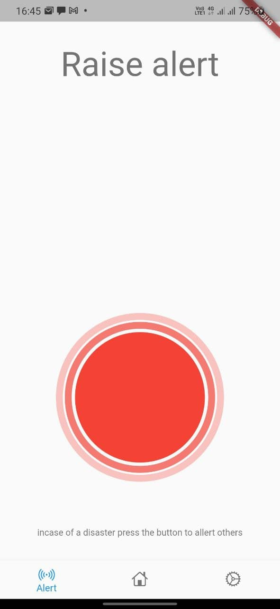
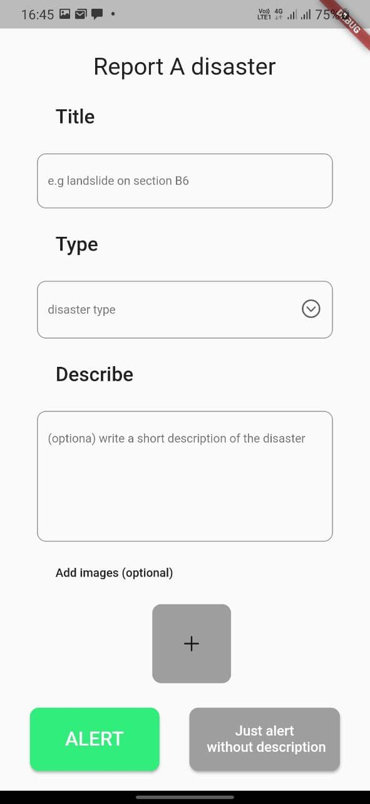
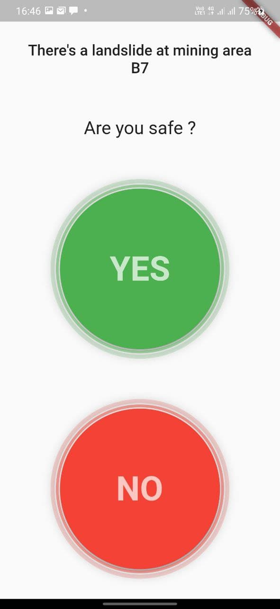
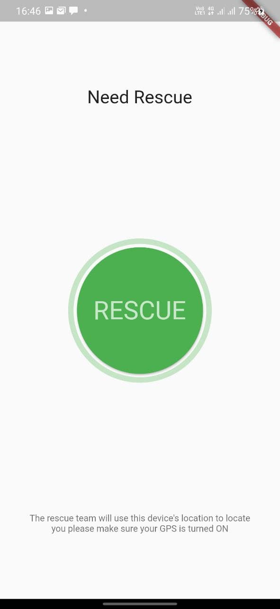
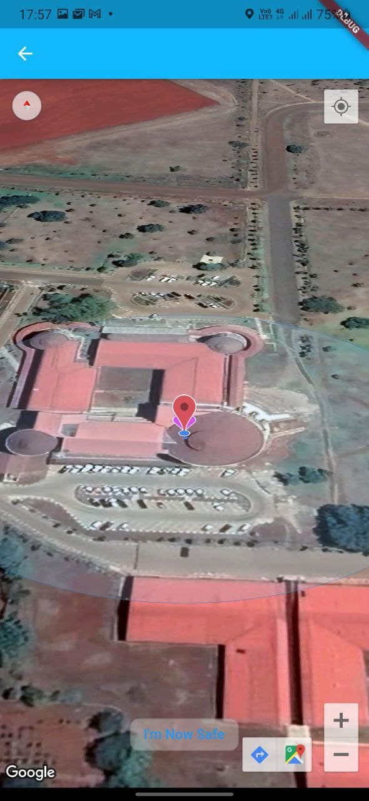
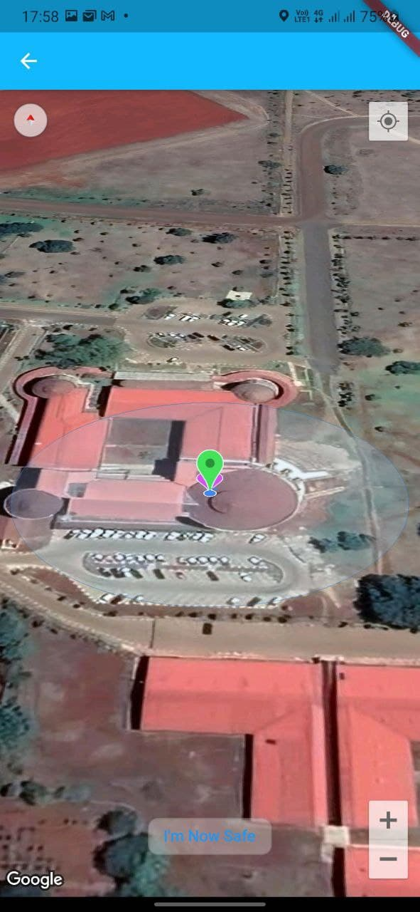
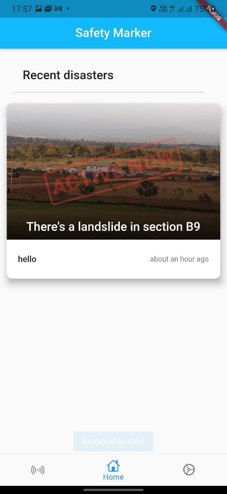
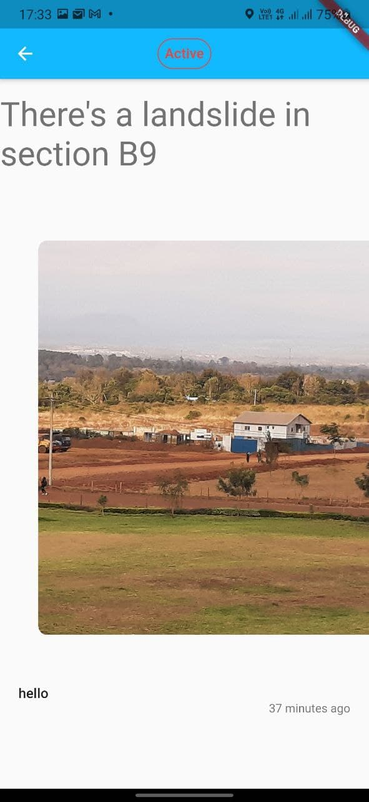

# Siemens Hackathon Safety Marker
![coverage][coverage_badge]
[![style: very good analysis][very_good_analysis_badge]][very_good_analysis_link]
[![License: MIT][license_badge]][license_link]

An application that mine employees can use to mark themselves as safe in the event of a disaster.\
This project was built with flutter because of its multiplatform support capabilities.


# Libraries
[Bloc](https://pub.dev/packages/bloc) : State management. \
[Formz](https://pub.dev/packages/formz) : A unified form representation in Dart. \
[Geolocator](https://pub.dev/packages/geolocator) : A Flutter geolocation plugin which provides easy access to platform specific location services. \
[Cloud Firestore](https://pub.dev/packages/cloud_firestore) : A Flutter plugin to use the Cloud Firestore API. \
[Firebase Storage](https://pub.dev/packages/firebase_storage) : Cloud sorage for flutter. \
[Firebase Messaging](https://pub.dev/packages/firebase_messaging) : Firebase messaging pugin for flutter. Used to deliver realtime notifications to the users. 
## Testing
[Fake Cloud Firestore](https://pub.dev/packages/fake_cloud_firestore) : Fakes to write unit tests for Cloud Firestore. \
[Firebase Auth Mocks](https://pub.dev/packages/firebase_auth_mocks) : Mocks for firebase authentication. \
[Bloc Test](https://pub.dev/packages/bloc_test) : A Dart package that makes testing blocs and cubits easy. \
[Mocktail](https://pub.dev/packages/mocktail) : Mock library for Dart.


# Screenshots
|||||
|:---:|:---:|:---:|:---:|
|||||
|||||
|||

---

## Getting Started 🚀

This project contains 3 flavors:

- development
- staging
- production

To run the desired flavor either use the launch configuration in VSCode/Android Studio or use the following commands:

```sh
# Development
$ flutter run --flavor development --target lib/main_development.dart

# Staging
$ flutter run --flavor staging --target lib/main_staging.dart

# Production
$ flutter run --flavor production --target lib/main_production.dart
```

_\*Siemens Hackathon Safety Marker works on iOS, Android, and Web._

---

## Running Tests 🧪

To run all unit and widget tests use the following command:

```sh
$ flutter test --coverage --test-randomize-ordering-seed random
```

To view the generated coverage report you can use [lcov](https://github.com/linux-test-project/lcov).

```sh
# Generate Coverage Report
$ genhtml coverage/lcov.info -o coverage/

# Open Coverage Report
$ open coverage/index.html
```

---

## Working with Translations 🌐

This project relies on [flutter_localizations][flutter_localizations_link] and follows the [official internationalization guide for Flutter][internationalization_link].

### Adding Strings

1. To add a new localizable string, open the `app_en.arb` file at `lib/l10n/arb/app_en.arb`.

```arb
{
    "@@locale": "en",
    "counterAppBarTitle": "Counter",
    "@counterAppBarTitle": {
        "description": "Text shown in the AppBar of the Counter Page"
    }
}
```

2. Then add a new key/value and description

```arb
{
    "@@locale": "en",
    "counterAppBarTitle": "Counter",
    "@counterAppBarTitle": {
        "description": "Text shown in the AppBar of the Counter Page"
    },
    "helloWorld": "Hello World",
    "@helloWorld": {
        "description": "Hello World Text"
    }
}
```

3. Use the new string

```dart
import 'package:siemens_hackathon_safety_marker/l10n/l10n.dart';

@override
Widget build(BuildContext context) {
  final l10n = context.l10n;
  return Text(l10n.helloWorld);
}
```

### Adding Supported Locales

Update the `CFBundleLocalizations` array in the `Info.plist` at `ios/Runner/Info.plist` to include the new locale.

```xml
    ...

    <key>CFBundleLocalizations</key>
	<array>
		<string>en</string>
		<string>es</string>
	</array>

    ...
```

### Adding Translations

1. For each supported locale, add a new ARB file in `lib/l10n/arb`.

```
├── l10n
│   ├── arb
│   │   ├── app_en.arb
│   │   └── app_es.arb
```

2. Add the translated strings to each `.arb` file:

`app_en.arb`

```arb
{
    "@@locale": "en",
    "counterAppBarTitle": "Counter",
    "@counterAppBarTitle": {
        "description": "Text shown in the AppBar of the Counter Page"
    }
}
```

`app_es.arb`

```arb
{
    "@@locale": "es",
    "counterAppBarTitle": "Contador",
    "@counterAppBarTitle": {
        "description": "Texto mostrado en la AppBar de la página del contador"
    }
}
```

[coverage_badge]: coverage_badge.svg
[flutter_localizations_link]: https://api.flutter.dev/flutter/flutter_localizations/flutter_localizations-library.html
[internationalization_link]: https://flutter.dev/docs/development/accessibility-and-localization/internationalization
[license_badge]: https://img.shields.io/badge/license-MIT-blue.svg
[license_link]: https://opensource.org/licenses/MIT
[very_good_analysis_badge]: https://img.shields.io/badge/style-very_good_analysis-B22C89.svg
[very_good_analysis_link]: https://pub.dev/packages/very_good_analysis
[very_good_cli_link]: https://github.com/VeryGoodOpenSource/very_good_cli
